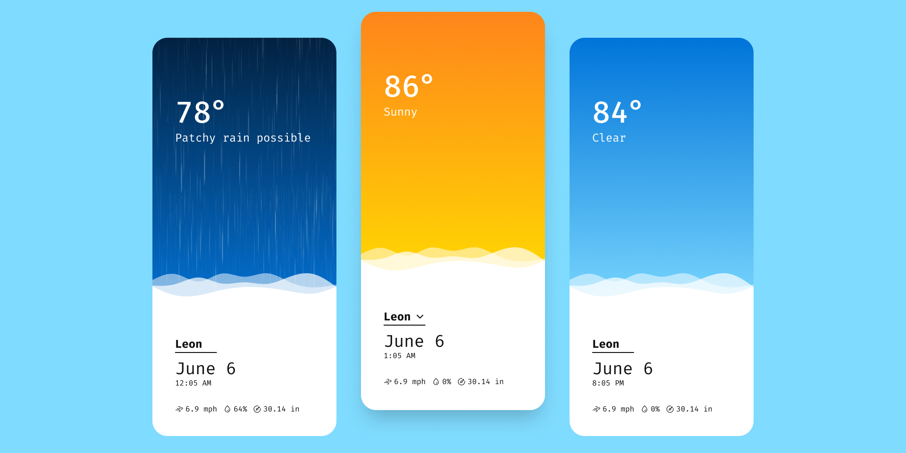

<p align="center">
  
  <h3 align="center">Simple Weather App</h3>
  <p align="center">A simple weather app made with ES modules and modern JavaScript</p>
  <p align="center">
  <a href="https://simpleweathr.surge.sh/" target="_blank" rel="noreferrer noopener">Live Demo</a>
  ⁕
  <a href="https://www.figma.com/file/hzTfN0x778NnRK2rVSbgPN/Simple-Weather?node-id=27%3A159" target="_blank" rel="noreferrer noopener">Figma Preview</a>
  ⁕
  <a href="https://github.com/fredoist/simple-weather/archive/refs/heads/main.zip" target="_blank" rel="noreferrer noopener">Repo Download</a>
  </p>
</p>

---


Simple Weather is a vanilla JS weather web app to try modern JavaScript and ES modules, no build step is necessary and everything works from the browser.
The app features your local weather and fetches the data from the API using stale while revalidate technique. You can also explore or view other locations by changing the query parameter in the URL.

## 🛠 Built using

- [RapidAPI & WeatherAPI.com](https://rapidapi.com/weatherapi/api/weatherapi-com/)
- [ESM CDN](https://esm.sh)
- [Vanilla SWR](https://www.npmjs.com/package/vanilla-swr)
- [nanohtml](https://www.npmjs.com/package/nanohtml)
- [Surge](https://surge.sh)

## ✨ Get started

To get started simply clone or [download ⇊](https://github.com/fredoist/simple-weather/archive/refs/heads/main.zip) this repository, no build or dependency installs is required.

You can develop in local by running a local server with hot-reloading, I recommend the followind:

```sh
$ npx reload .
```

## 📄 License

Distributed under the MIT License. See `LICENSE` for more information.
